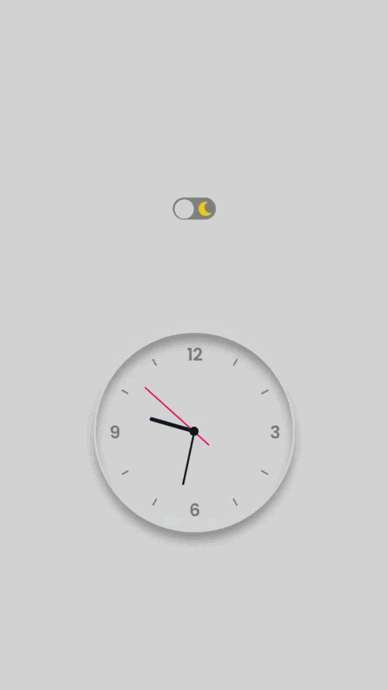

# RelogioAnalogico

<strong><h1>Relógio analógico com Dark Mode</h1></strong>

<em><h2>Projeto desenvolvido para fins de estudo e teste de conhecimentos.</h2></em>

Depois de algumas pesquisas e quebrar bastante a cabeça conseguir desenvolver este relógio analógico 
Não contente com apenas o relógio e seu funcionamento decidi me aventurar fazendo o dark mode 
Depois de quebra a cabeça um pouquinho mais tudo feito, relógio e dark mode funcionando perfeitamente

 

O código do relógio em si é bem simples.

<em><h5>Código <strong>HTML</strong> do botão e do relógio.</h5></em>

 

A maior parte do código fica por conta da estilização do relógio feita em CSS.

 

A baixo segue GIF do fncionamento do Relógio e do Dark Mode.

<em><h5>GIF do funcionamento do relógio e do dark mode.</h5></em>

 

Neste projeto utilisei um pouco de <strong>HTML</strong>, um pouco de <strong>JavaScript</strong> e bastante <strong>CSS</strong>.

 

<em>
Espero que voce tenha gostado, 
Atenciosamente: <strong>Douglas Rezende</strong>
</em>
<h4>Contato: <strong>douglasrezende198@gmail.com</strong></h4>